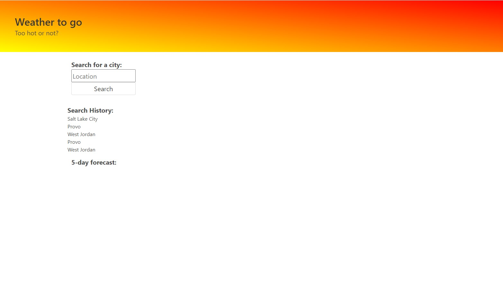

# go.maybe.no

This is a weather app using a 3rd party API.  It fetches the City weather information from the API, when the city is inputed on the page. The information is brought back and put onto the page 
in a user friendly way using HTML, CSS and Javascript.  I created elements of boxes, utilized local storage, and future weather conditions for the inputed city. A 5 day forecast is presented. I had help from 
a tutor on this assignment. 

https://jelu113.github.io/go.maybe.no/

https://github.com/Jelu113/go.maybe.no

